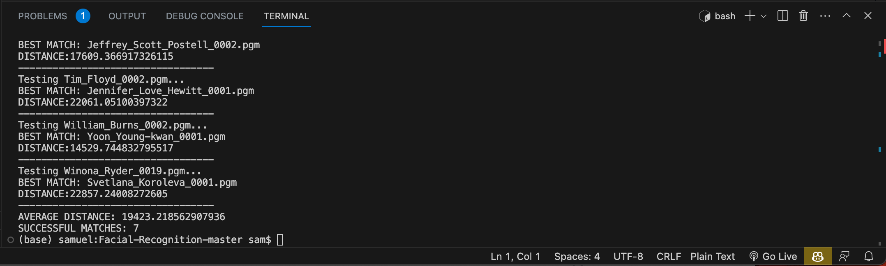

To run, call ```python FacialRecognition.py``` in your terminal.

### IDEA 
The algorithm reads in pre-processed PGM image files from the `/duplicate` folder, a simple gray-scale image format and utilizes eigenvalues, eigenvectors, and vector projection to compute the weights and distances between input images and images in `/library` folder. The algorithm attempts to match the same individuals appearing in both libraries.

Images are pre-processed by zooming into head region and ensuring face is centered in image and forward facing.


### IMPLEMENTATION
I use python and numpy in my implementation, to represent the face image as a matrix and mathematical operations are used to isolate the features that distinguish each face. In particular, the eigenvalues and eigenvectors of this matrix are calculated and used to identify the significant features of each image. This process is known as eigenface analysis.

### PERFORMANCE
Overall, the use of eigenvalues, eigenvectors, and vector projection allows the facial recognition algorithm to analyze and identify the specific features that distinguish between different face images, and use this information to accurately match input images to their closest matches in the library. The algorithm initally has a hit rate of 8% but we are able to get a 9% hit rate by cropping and increasing the contrast of each image before calculations.

